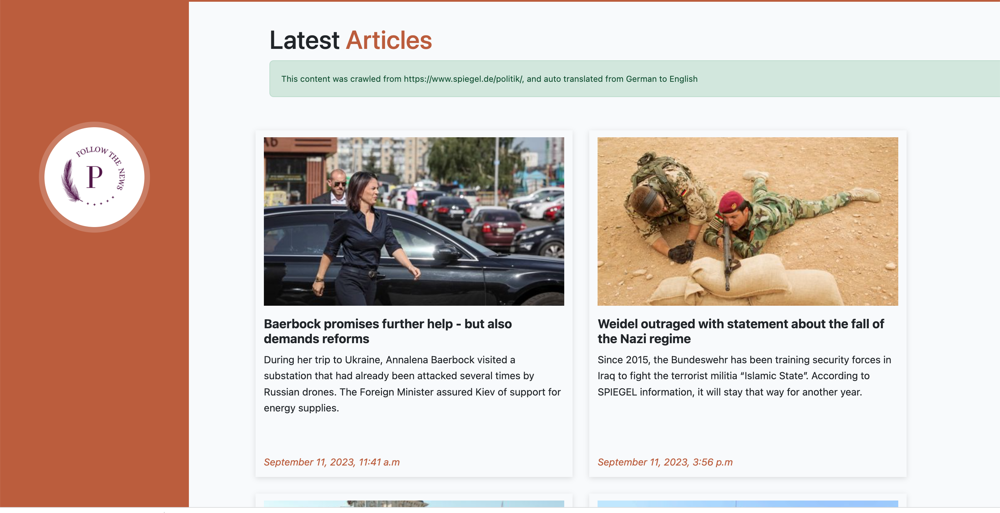

A simple web crawler, with the ability to pull and translate text to English. 

## Technology Stack and Tools
 
 - Laravel
 - Google Translate
 - Vue JS
 - MySQL
 - CSS Bootsrap
 - Axios HTTP Client
 - XML

## Set up Instruction
  - Clone the repo
  - CD into cloned directory and run  `touch .env` to create a new .env file
  - Copy all contents in .env.example into newly created .env file
  - Install composer  `composer install`
  - Install npm modules  `npm install`
  - Generate a new key with `php artisan key:generate`
  - Open PHPMyAdmin or whichever tool you use and create a new mysql database
  - Open .env and add db credentials
  - Clear config cache with `php artisan cache:clear`
  - Run migrations with `php artisan migrate`

## Web crawling
 - Run `php artisan web:crawl` 

 ## Demo Link
 - https://webcrawler.monamoxie.com/
  

 
## License

This software is open-sourced software and licensed under the [MIT license](https://opensource.org/licenses/MIT).
